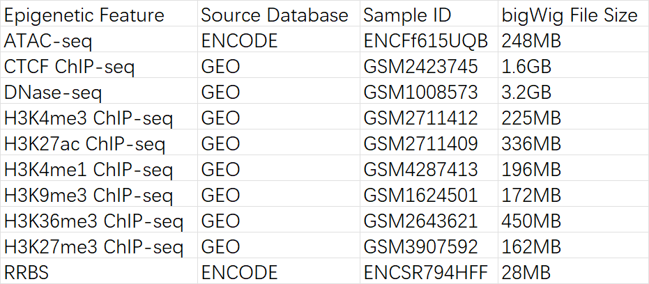
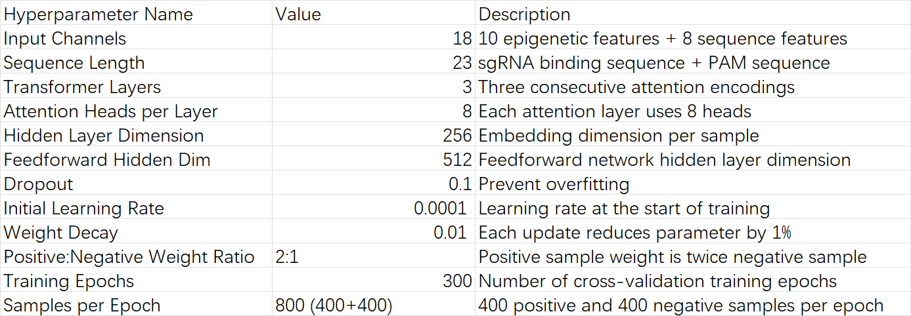

# CCMU: CRISPR-Cas9 Off‑target Prediction


CCMU (Combined Multi-feature Unified model) is a Transformer-based classifier designed to predict CRISPR-Cas9 off-target activity. The model integrates nucleotide sequence context with ten epigenetic tracks and was trained using five-fold cross-validation.

## Data Source



The repository includes scripts to download example sequences, epigenetic tracks and pre-trained weights. Fetch all required files with:

```bash
bash download.sh
```

## Main Hyperparameters



## Model Architecture


## Running Inference

Choose the inference script depending on the configuration you wish to evaluate:

```bash
python infer_combined.py        # sequence + epigenetic features
python infer_seq_only_model.py  # sequence features only
python infer_epi_only.py        # epigenetic features only
```

## License

This project is licensed under the terms of the [MIT License](LICENSE).
