# CCMU: CRISPR-Cas9 Off‑target Prediction
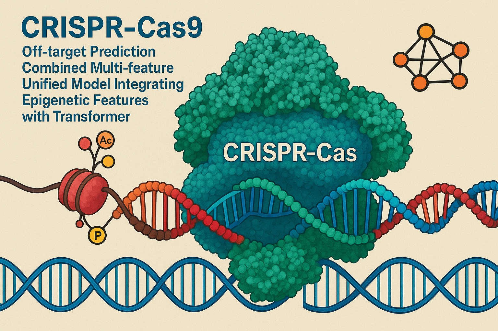
# Table of Contents
- [Overview](#overview)
- [How to Use](#how-to-use)
- [Data Sources](#data-sources)
  - [Table 1. Data Sources](#table-1-data-sources)
- [Hyperparameters](#hyperparameters)
  - [Table 2. Main Hyperparameters](#table-2-main-hyperparameters)
- [Model Architecture](#model-architecture)
- [Benchmark on MIT and CFD Datasets](#benchmark-on-mit-and-cfd-datasets)
  - [Table 3. MIT Algorithm Metrics](#table-3-mit-algorithm-metrics)
  - [Figure 2. MIT: FNR and FPR vs. Cutoff](#figure-2-mit-fnr-and-fpr-vs-cutoff)
  - [Table 4. CFD algorithm metrics](#table-4-cfd-algorithm-metrics)
  - [Figure 3. CFD: FNR and FPR vs. Cutoff](#figure-3-cfd-fnr-and-fpr-vs-cutoff)
  - [Table 5. Mixed model five-fold cross-validation metrics](#table-5-mixed-model-five-fold-cross-validation-metrics)
  - [Figure 4. Combined Model Performance](#figure-4-combined-model-performance)
  - [Table 6. Epigenetic-only model five-fold cross-validation metrics](#table-6-epigenetic-only-model-five-fold-cross-validation-metrics)
  - [Figure 5. Epigenetic-only Model Performance](#figure-5-epigenetic-only-model-performance)
  - [Table 7. Sequence-only model five-fold cross-validation metrics](#table-7-sequence-only-model-five-fold-cross-validation-metrics)
  - [Figure 6. Sequence-only Model Performance](#figure-6-sequence-only-model-performance)
- [Comparison Across Models](#comparison-across-models)
  - [Figure 7. Comparison Across Models](#figure-7-comparison-across-models)
- [Attention Mechanism](#attention-mechanism)
  - [Figure 8. Positive](#figure-8-positive)
  - [Figure 9. Negative](#figure-9-negative)
- [Acknowledgments](#acknowledgments)
- [Project Status](#project-status)
# Overview
CCMU (Combined Multi-feature Unified model) is a Transformer-based classifier for predicting CRISPR-Cas9 off-target activity. The model integrates nucleotide sequence context with ten epigenetic tracks and is trained using five-fold cross-validation. This repository provides scripts to download the example dataset and to run inference using the released weights.

# How to Use
Follow these steps to reproduce the example results:

1. **Create the environment** (requires Conda):
   ```bash
   conda env create -f CCMU.yml
   conda activate CCMU
   ```

2. **Download the data and pre-trained weights**:
   ```bash
   bash download.sh
   ```
   This runs the helper scripts in `download_scripts/` to fetch epigenetic data,
   mean and standard deviation files, training data, and weight checkpoints.

3. **Run inference** with one of the provided Python scripts:
   ```bash
   python infer_combined.py       # full model using sequence + epigenetics
   python infer_epi_only.py       # model using only epigenetic channels
   python infer_seq_only_model.py # model using only sequence information
   ```

# Data Sources
## Table 1. Data Sources
| Epigenetic Feature | Source Database | Sample ID      | File Size |
|--------------------|-----------------|---------------|------------------|
| ATAC-seq           | ENCODE          | ENCFF615UQB   | 248 MB           |
| CTCF ChIP-seq      | GEO             | GSM2423745    | 1.6 GB           |
| DNase-seq          | GEO             | GSM1008573    | 3.2 GB           |
| H3K4me3 ChIP-seq   | GEO             | GSM2711412    | 225 MB           |
| H3K27ac ChIP-seq   | GEO             | GSM2711409    | 336 MB           |
| H3K4me1 ChIP-seq   | GEO             | GSM4287413    | 196 MB           |
| H3K9me3 ChIP-seq   | GEO             | GSM1624501    | 172 MB           |
| H3K36me3 ChIP-seq  | GEO             | GSM2643621    | 450 MB           |
| H3K27me3 ChIP-seq  | GEO             | GSM3907592    | 162 MB           |
| RRBS               | ENCODE          | ENCSR794HFF   | 28 MB            |
# Hyperparameters
## Table 2. Main Hyperparameters
| Hyperparameter Name         | Value               | Description                                    |
|----------------------------|---------------------|------------------------------------------------|
| Input Channels              | 18                  | 10 epigenetic features + 8 sequence features   |
| Sequence Length             | 23                  | sgRNA binding sequence + PAM sequence          |
| Transformer Layers          | 3                   | Three consecutive attention encodings          |
| Attention Heads per Layer   | 8                   | Each attention layer uses 8 heads              |
| Hidden Layer Dimension      | 256                 | Embedding dimension per sample                 |
| Feedforward Hidden Dim      | 512                 | Feedforward network hidden layer dimension     |
| Dropout                     | 0.1                 | Prevent overfitting                            |
| Initial Learning Rate       | 0.0001              | Learning rate at the start of training         |
| Weight Decay                | 0.01                | Each update reduces parameter by 1%            |
| Positive:Negative Weight Ratio | 2:1              | Positive sample weight is twice negative sample|
| Training Epochs             | 300                 | Number of cross-validation training epochs     |
| Samples per Epoch           | 800 (400+400)       | 400 positive and 400 negative samples per epoch|
# Model Architecture
## Figure 1. Model Architecture
<p align="center">
  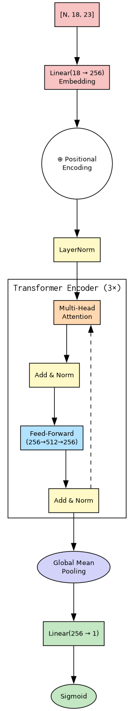
</p>
Schematic of the model architecture. The input tensor [𝑁,18,23]
[N,18,23] is linearly embedded into a 256-dimensional space, followed by positional encoding and layer normalization. The processed sequence passes through three stacked transformer encoder layers, each consisting of multi-head self-attention, add & norm, and a feed-forward network (256→512→256). The output is globally pooled across the sequence dimension, then passed through a linear layer and sigmoid activation to produce the final prediction.
This design enables the model to capture contextual dependencies within sequences and output a probability score for each sample.
# Benchmark on MIT and CFD Datasets
## Table 3. MIT Algorithm Metrics
| Fold | FNR Constraint | FPR    | ROC-AUC | PR-AUC |
|------|---------------|--------|---------|--------|
| 1    | FNR=0.1       | 1.0000 | 0.681   | 0.110  |
| 2    | FNR=0.1       | 0.5120 | 0.720   | 0.101  |
| 3    | FNR=0.1       | 1.0000 | 0.672   | 0.100  |
| 4    | FNR=0.1       | 1.0000 | 0.707   | 0.128  |
| 5    | FNR=0.1       | 0.5150 | 0.704   | 0.106  |
## Figure 2. MIT Algorithm Metrics
<table align="center">
  <tr>
    <td align="center">
      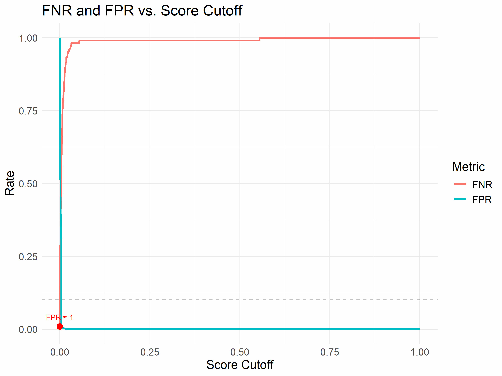<br>
      <b>a. FNR and FPR vs. Cutoff</b>
    </td>
    <td align="center">
      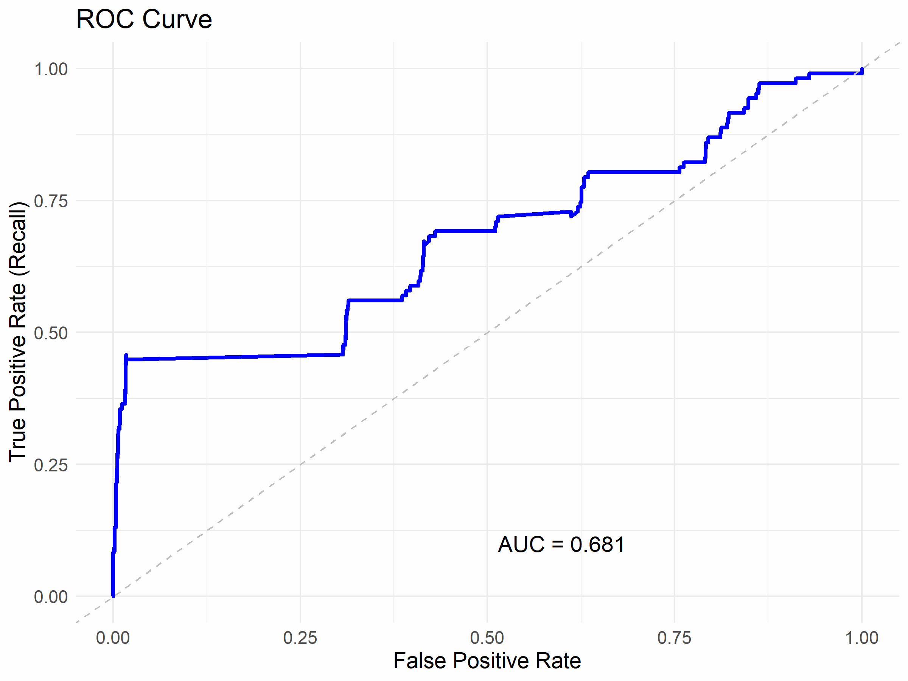<br>
      <b>b. ROC Curve</b>
    </td>
  </tr>
  <tr>
    <td align="center">
      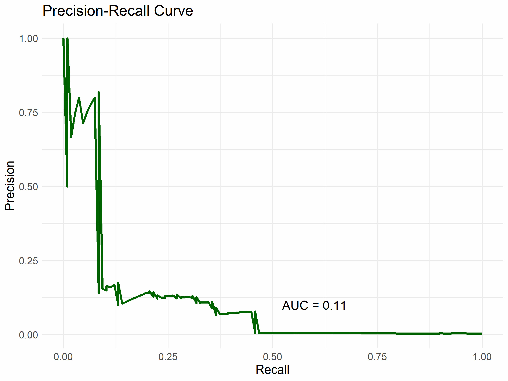<br>
      <b>c. PR Curve</b>
    </td>
    <td align="center">
      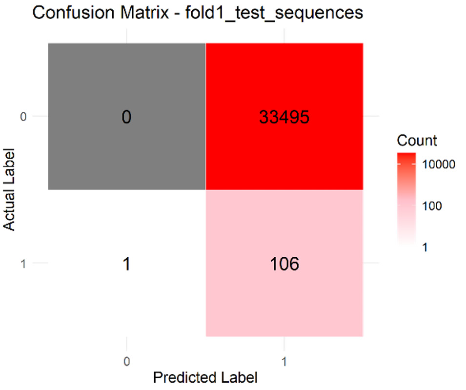<br>
      <b>d. Confusion matrix</b>
    </td>
  </tr>
</table>

## Table 4. CFD algorithm metrics
| Fold | FNR Constraint | FPR    | ROC-AUC | PR-AUC |
|------|---------------|--------|---------|--------|
| 1    | FNR=0.1       | 0.720  | 0.825   | 0.230  |
| 2    | FNR=0.1       | 0.576  | 0.801   | 0.203  |
| 3    | FNR=0.1       | 0.886  | 0.794   | 0.279  |
| 4    | FNR=0.1       | 0.590  | 0.832   | 0.242  |
| 5    | FNR=0.1       | 0.589  | 0.826   | 0.270  |
## Figure 3. CFD algorithm metrics
<table align="center">
  <tr>
    <td align="center">
      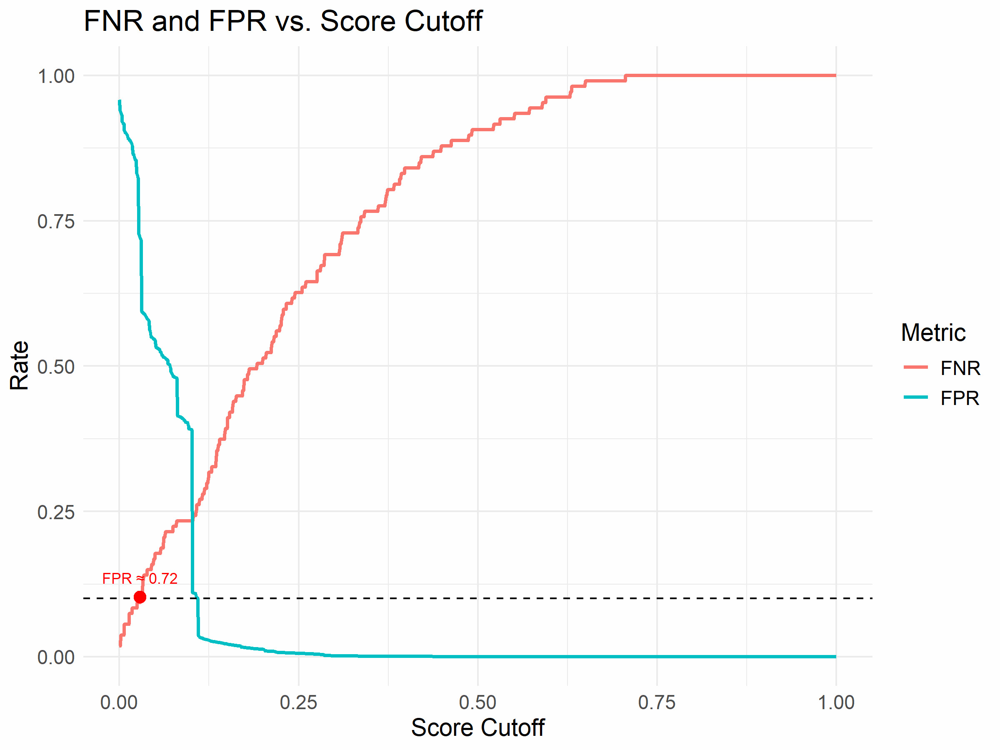<br>
      <b>a. FNR and FPR vs cutoff</b>
    </td>
    <td align="center">
      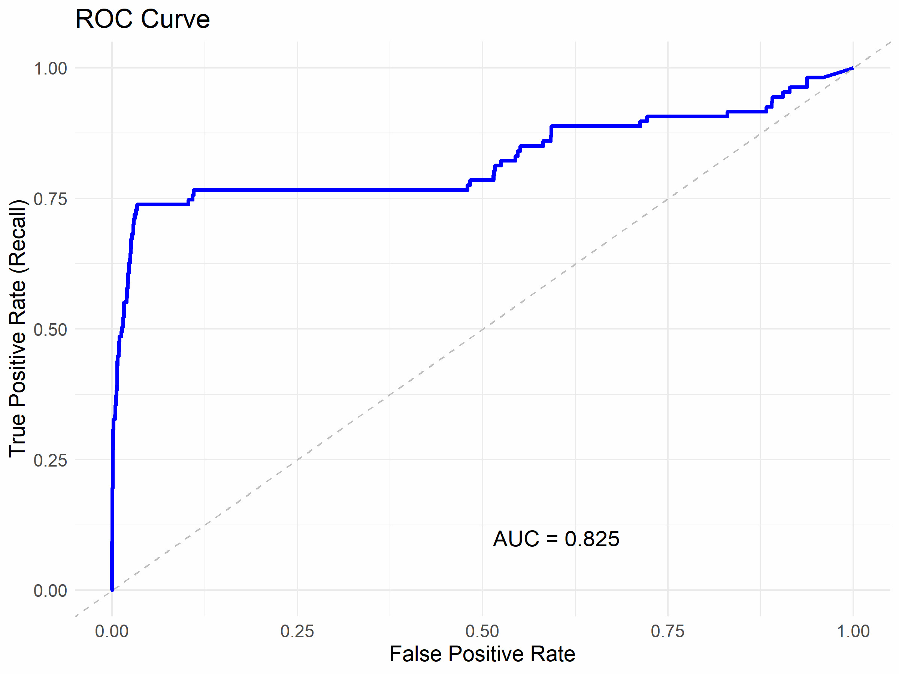<br>
      <b>b. ROC Curve</b>
    </td>
  </tr>
  <tr>
    <td align="center">
      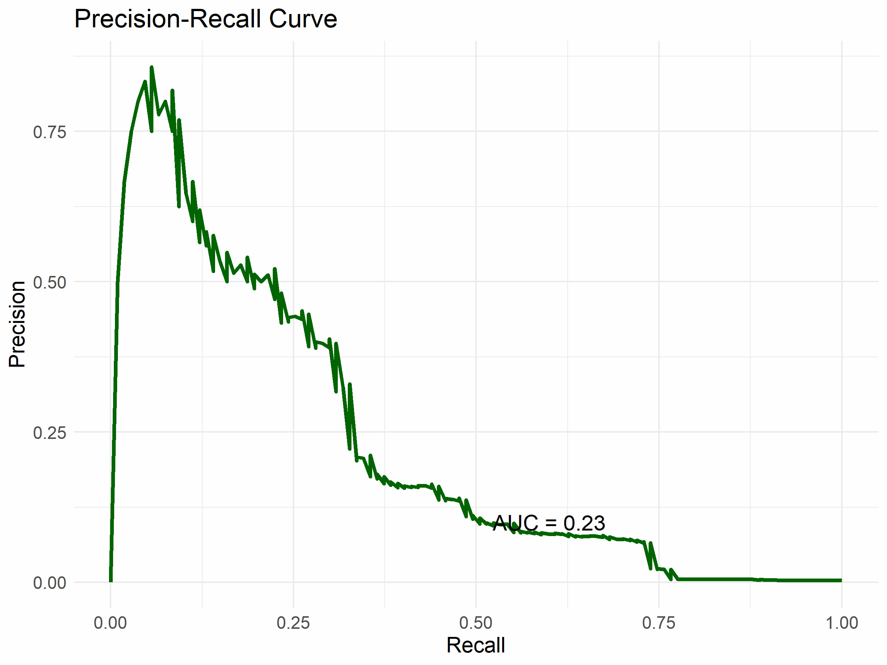<br>
      <b>c. PR Curve</b>
    </td>
    <td align="center">
      <br>
      <b>d. Confusion matrix</b>
    </td>
  </tr>
</table>

## Table 5. Mixed model five-fold cross-validation metrics
| Fold | FNR Constraint |  FPR    | ROC-AUC | PR-AUC |
|------|---------------|---------|---------|--------|
| 1    | FNR < 0.1     | 0.0694  | 0.97    | 0.14   |
| 2    | FNR < 0.1     | 0.0789  | 0.97    | 0.11   |
| 3    | FNR < 0.1     | 0.0553  | 0.97    | 0.11   |
| 4    | FNR < 0.1     | 0.0742  | 0.96    | 0.09   |
| 5    | FNR < 0.1     | 0.1446  | 0.97    | 0.13   |
## Figure 4. Combined Model Performance
<table align="center">
  <tr>
    <td align="center" colspan="2">
      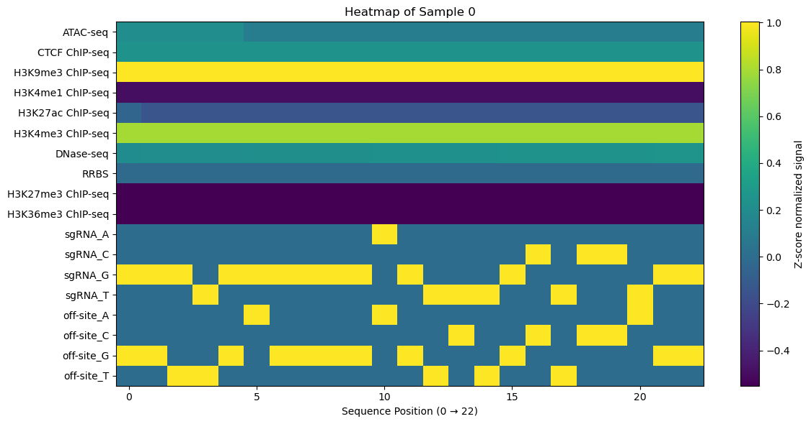<br>
      <b>a. One sample</b>
    </td>
  </tr>
  <tr>
    <td align="center" colspan="2">
      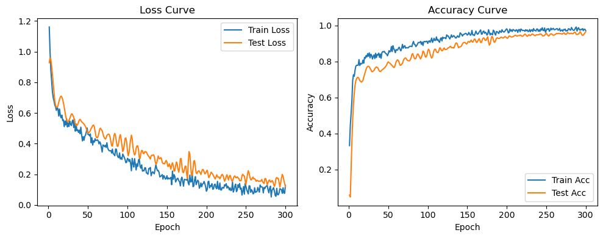<br>
      <b>b. Loss & accuracy over iterations</b>
    </td>
  </tr>
  <tr>
    <td align="center" width="350">
      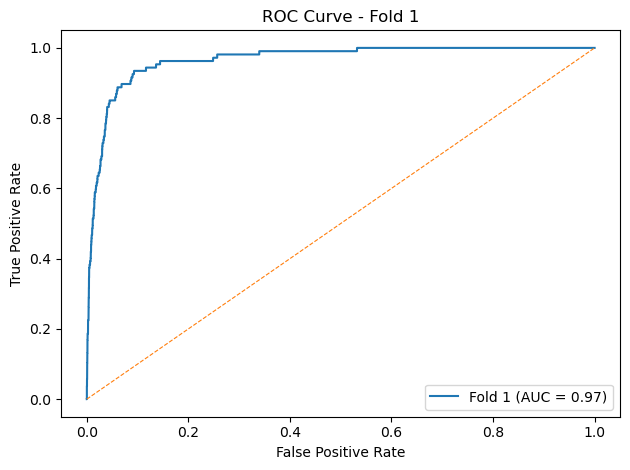<br>
      <b>c. ROC Curve</b>
    </td>
    <td align="center" width="350">
      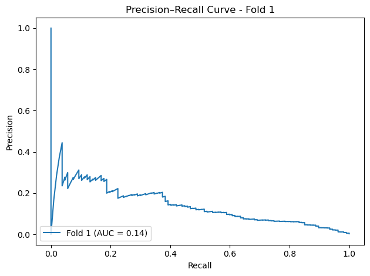<br>
      <b>d. PR Curve</b>
    </td>
  </tr>
  <tr>
    <td align="center" width="350">
      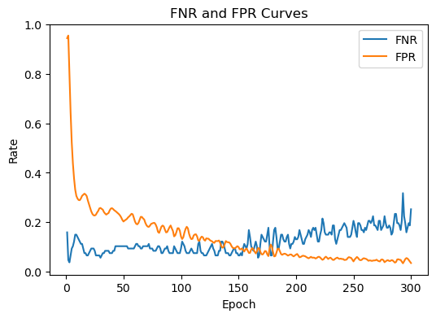<br>
      <b>e. FNR & FPR over iteration</b>
    </td>
    <td align="center" width="350">
      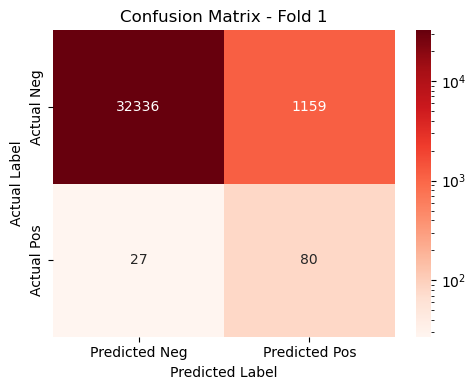<br>
      <b>f. Confusion Matrix</b>
    </td>
  </tr>
</table>

## Table 6. Epigenetic-only model five-fold cross-validation metrics
| Fold | FNR Constraint |  FPR    | ROC-AUC | PR-AUC |
|------|---------------|---------|---------|--------|
| 1    | FNR < 0.1     | 0.5709  | 0.83    | 0.02   |
| 2    | FNR < 0.1     | 0.5923  | 0.86    | 0.03   |
| 3    | FNR < 0.1     | 0.3681  | 0.85    | 0.02   |
| 4    | FNR < 0.1     | 0.3501  | 0.86    | 0.03   |
| 5    | FNR < 0.1     | 0.5748  | 0.83    | 0.03   |
## Figure 5. Epigenetic-only Model Performance
<table align="center">
  <tr>
    <td align="center" colspan="2">
      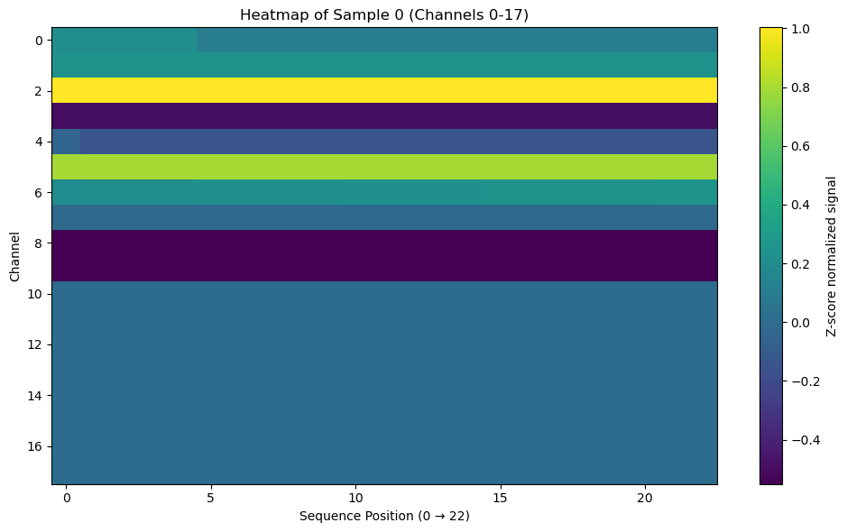<br>
      <b>a. One sample</b>
    </td>
  </tr>
  <tr>
    <td align="center" colspan="2">
      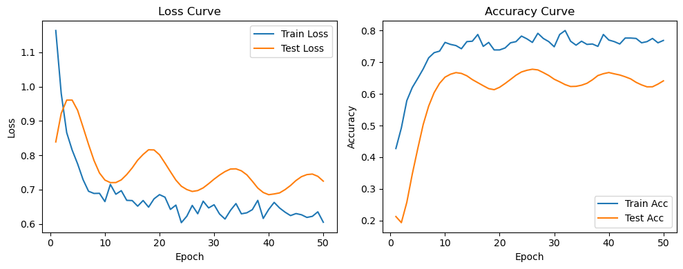<br>
      <b>b. Loss & accuracy over iterations</b>
    </td>
  </tr>
  <tr>
    <td align="center" width="350">
      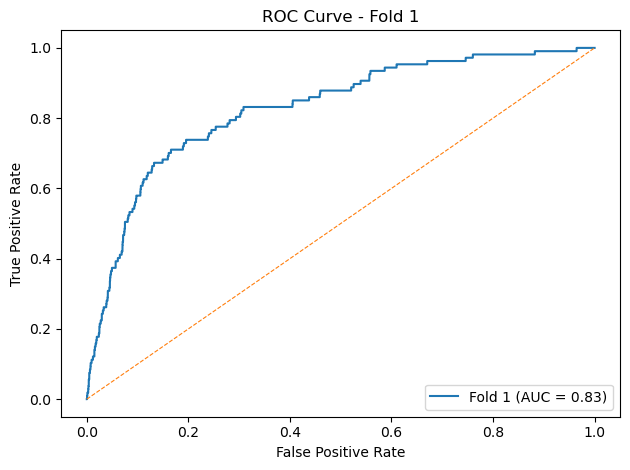<br>
      <b>c. ROC Curve</b>
    </td>
    <td align="center" width="350">
      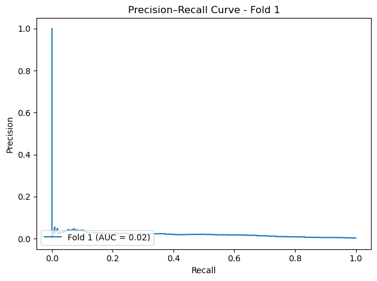<br>
      <b>d. PR Curve</b>
    </td>
  </tr>
  <tr>
    <td align="center" width="350">
      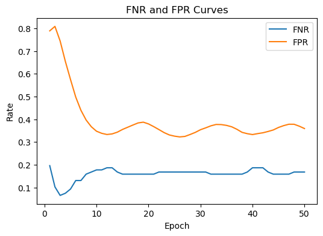<br>
      <b>e. FNR & FPR over iteration</b>
    </td>
    <td align="center" width="350">
      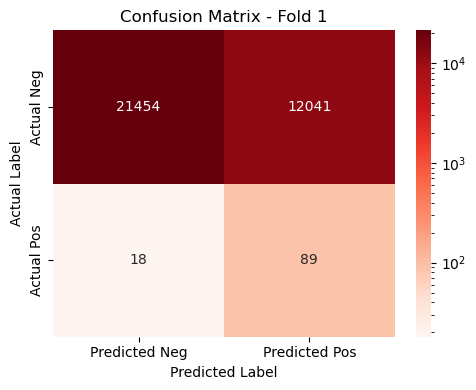<br>
      <b>f. Confusion Matrix</b>
    </td>
  </tr>
</table>

## Table 7. Sequence-only model five-fold cross-validation metrics
| Fold | FNR Constraint |  FPR    | ROC-AUC | PR-AUC |
|------|---------------|---------|---------|--------|
| 1    | FNR < 0.1     | 0.0390  | 0.99    | 0.31   |
| 2    | FNR < 0.1     | 0.0316  | 0.99    | 0.40   |
| 3    | FNR < 0.1     | 0.0393  | 0.99    | 0.40   |
| 4    | FNR < 0.1     | 0.0340  | 0.99    | 0.36   |
| 5    | FNR < 0.1     | 0.0348  | 0.99    | 0.40   |
## Figure 6. Sequence-only Model Performance
<table align="center">
  <tr>
    <td align="center" colspan="2">
      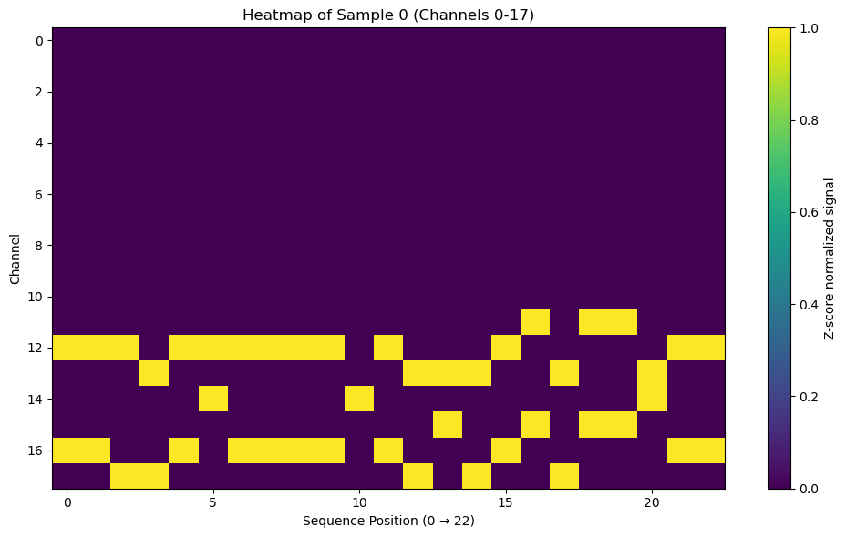<br>
      <b>a. One sample</b>
    </td>
  </tr>
  <tr>
    <td align="center" colspan="2">
      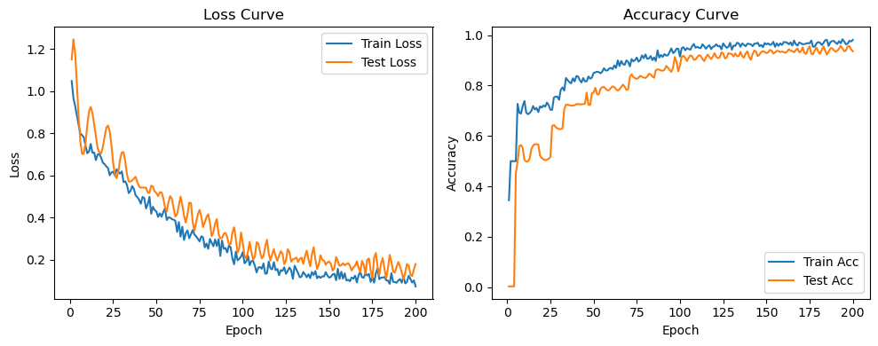<br>
      <b>b. Loss & accuracy over iterations</b>
    </td>
  </tr>
  <tr>
    <td align="center" width="350">
      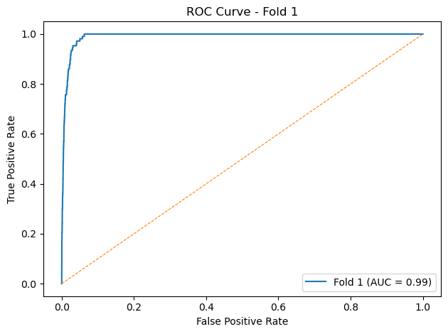<br>
      <b>c. ROC Curve</b>
    </td>
    <td align="center" width="350">
      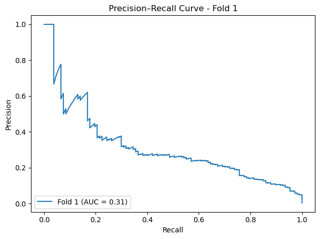<br>
      <b>d. PR Curve</b>
    </td>
  </tr>
  <tr>
    <td align="center" width="350">
      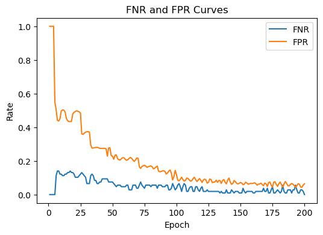<br>
      <b>e. FNR & FPR over iteration</b>
    </td>
    <td align="center" width="350">
      <br>
      <b>f. Confusion Matrix</b>
    </td>
  </tr>
</table>

# Comparison Across Models
## Figure 7. Comparison Across Models
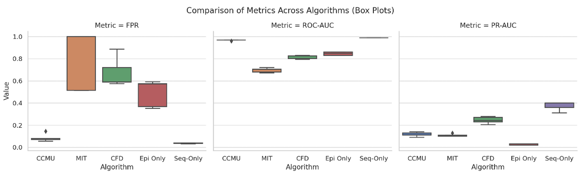

# Attention Mechanism
## Figure 8. Positive
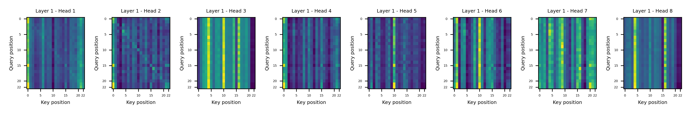
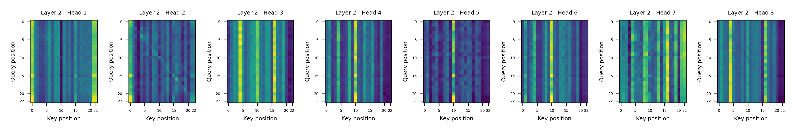
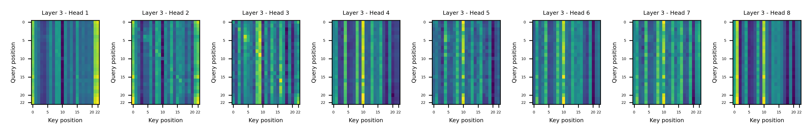
## Figure 9. Negative
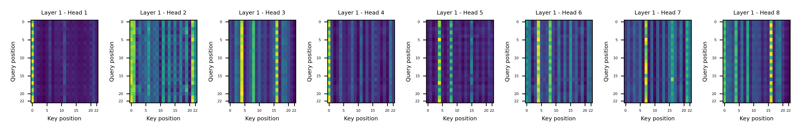
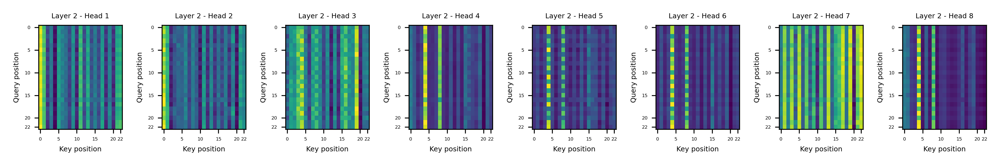


# Acknowledgments
I gratefully thank my parents for supporting this project and providing the funds to rent cloud servers for model training.

# Project Status
Due to the current low level of interest in this repository, updates will be infrequent. If the project reaches 20 stars, development will resume with improvements such as an evolved tensor generator, additional protocols, and better architectures.
