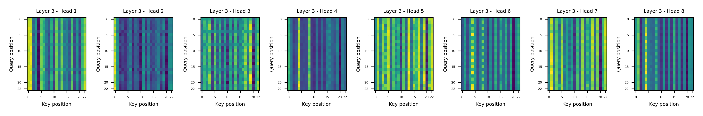

# CCMU: CRISPR-Cas9 Off-target Prediction Combined Multi-feature Unified Model Integrating Epigenetic Features with Transformer 

# Table of Contents
- [Overview](#overview)
- [How to Use](#how-to-use)
- [Data Sources](#data-sources)
  - [Table 1. Data Sources](#table-1-data-sources)
- [Hyperparameters](#hyperparameters)
  - [Table 2. Main Hyperparameters](#table-2-main-hyperparameters)
- [Model Architecture](#model-architecture)
- [Benchmark on MIT, CFD, and CCMU Series Models](#benchmark-on-mit-cfd-and-ccmu-series-models)
  - [Table 3. MIT Algorithm Metrics](#table-3-mit-algorithm-metrics)
  - [Figure 2. MIT Algorithm Metrics](#figure-2-mit-algorithm-metrics)
  - [Table 4. CFD Algorithm Metrics](#table-4-cfd-algorithm-metrics)
  - [Figure 3. CFD Algorithm Metrics](#figure-3-cfd-algorithm-metrics)
  - [Table 5. Mixed Model Five-Fold Cross-Validation Metrics](#table-5-mixed-model-five-fold-cross-validation-metrics)
  - [Figure 4. Combined Model Performance](#figure-4-combined-model-performance)
  - [Table 6. Epigenetic-only CCMU Five-Fold Cross-Validation Metrics](#table-6-epigenetic-only-ccmu-five-fold-cross-validation-metrics)
  - [Figure 5. Epigenetic-only CCMU Performance](#figure-5-epigenetic-only-ccmu-performance)
  - [Table 7. Sequence-only CCMU Five-Fold Cross-Validation Metrics](#table-7-sequence-only-ccmu-five-fold-cross-validation-metrics)
  - [Figure 6. Sequence-only CCMU Performance](#figure-6-sequence-only-ccmu-performance)
- [Comparison Across Models](#comparison-across-models)
  - [Figure 7. Comparison Across Models](#figure-7-comparison-across-models)
- [Attention Mechanism](#attention-mechanism)
  - [Figure 8. Positive](#figure-8-positive)
  - [Figure 9. Negative](#figure-9-negative)
- [Conclusion](#conclusion)
- [Acknowledgments](#acknowledgments)
- [Project Status](#project-status)
# Overview
CCMU (CRISPR-Cas9 Off-target Prediction Combined Multi-feature Unified Model) is a Transformer-based classifier for predicting CRISPR-Cas9 off-target activity. The model integrates nucleotide sequence context with ten epigenetic tracks and is trained using five-fold cross-validation. This repository provides scripts to download the example dataset and to run inference using the released weights.

# How to Use
Follow these steps to reproduce the example results:

1. **Create the environment** (requires Conda):
   ```bash
   conda env create -f CCMU.yml
   conda activate CCMU
   ```

2. **Download the data and pre-trained weights**:
   ```bash
   bash download.sh
   ```
   This runs the helper scripts in `download_scripts/` to fetch epigenetic data,
   mean and standard deviation files, training data, and weight checkpoints.

3. **Run inference** with one of the provided Python scripts:
   ```bash
   python infer_combined.py       # full model using sequence + epigenetics
   python infer_epi_only.py       # model using only epigenetic channels
   python infer_seq_only_model.py # model using only sequence information
   ```

# Data Sources
## Table 1. Data Sources
| Epigenetic Feature | Source Database | Sample ID      | File Size |
|--------------------|-----------------|---------------|------------------|
| ATAC-seq           | ENCODE          | ENCFF615UQB   | 248 MB           |
| CTCF ChIP-seq      | GEO             | GSM2423745    | 1.6 GB           |
| DNase-seq          | GEO             | GSM1008573    | 3.2 GB           |
| H3K4me3 ChIP-seq   | GEO             | GSM2711412    | 225 MB           |
| H3K27ac ChIP-seq   | GEO             | GSM2711409    | 336 MB           |
| H3K4me1 ChIP-seq   | GEO             | GSM4287413    | 196 MB           |
| H3K9me3 ChIP-seq   | GEO             | GSM1624501    | 172 MB           |
| H3K36me3 ChIP-seq  | GEO             | GSM2643621    | 450 MB           |
| H3K27me3 ChIP-seq  | GEO             | GSM3907592    | 162 MB           |
| RRBS               | ENCODE          | ENCSR794HFF   | 28 MB            |
# Hyperparameters
## Table 2. Main Hyperparameters
| Hyperparameter Name         | Value               | Description                                    |
|----------------------------|---------------------|------------------------------------------------|
| Input Channels              | 18                  | 10 epigenetic features + 8 sequence features   |
| Sequence Length             | 23                  | sgRNA binding sequence + PAM sequence          |
| Transformer Layers          | 3                   | Three consecutive attention encodings          |
| Attention Heads per Layer   | 8                   | Each attention layer uses 8 heads              |
| Hidden Layer Dimension      | 256                 | Embedding dimension per sample                 |
| Feedforward Hidden Dim      | 512                 | Feedforward network hidden layer dimension     |
| Dropout                     | 0.1                 | Prevent overfitting                            |
| Initial Learning Rate       | 0.0001              | Learning rate at the start of training         |
| Weight Decay                | 0.01                | Each update reduces parameter by 1%            |
| Positive:Negative Weight Ratio | 2:1              | Positive sample weight is twice negative sample|
| Training Epochs             | 300                 | Number of cross-validation training epochs     |
| Samples per Epoch           | 800 (400+400)       | 400 positive and 400 negative samples per epoch|
# Model Architecture
## Figure 1. Model Architecture
<p align="center">
  
</p>
Schematic of the model architecture. The input tensor [N,18,23] is linearly embedded into a 256-dimensional space, followed by positional encoding and layer normalization. The processed sequence passes through three stacked transformer encoder layers, each consisting of multi-head self-attention, add & norm, and a feed-forward network (256→512→256). The output is globally pooled across the sequence dimension, then passed through a linear layer and sigmoid activation to produce the final prediction.
This design enables the model to capture contextual dependencies within sequences and output a probability score for each sample.

# Benchmark on MIT, CFD, and CCMU Series Models
## Table 3. MIT Algorithm Metrics
| Fold | FNR Constraint | FPR    | ROC-AUC | PR-AUC |
|------|---------------|--------|---------|--------|
| 1    | FNR=0.1       | 1.0000 | 0.681   | 0.110  |
| 2    | FNR=0.1       | 0.5120 | 0.720   | 0.101  |
| 3    | FNR=0.1       | 1.0000 | 0.672   | 0.100  |
| 4    | FNR=0.1       | 1.0000 | 0.707   | 0.128  |
| 5    | FNR=0.1       | 0.5150 | 0.704   | 0.106  |

Across the five folds, the FNR constraint of 0.1 leads to variable but generally high FPRs (ranging from 0.512 to 1.000), with moderate ROC-AUC values (0.672 to 0.720), and consistently low PR-AUCs (0.100 to 0.128).

## Figure 2. MIT Algorithm Metrics
<table align="center">
  <tr>
    <td align="center">
      <br>
      <b>a. FNR and FPR vs. Cutoff</b>
    </td>
    <td align="center">
      <br>
      <b>b. ROC Curve</b>
    </td>
  </tr>
  <tr>
    <td align="center">
      <br>
      <b>c. PR Curve</b>
    </td>
    <td align="center">
      <br>
      <b>d. Confusion matrix</b>
    </td>
  </tr>
</table>

Figure 2a. FNR and FPR vs. Score Cutoff:
When the score threshold is set such that the False Negative Rate (FNR) equals 0.1, the False Positive Rate (FPR) reaches 1.0. This means that, to maintain the desired FNR, the model misclassifies all negative samples as positives.

Figure 2b. ROC Curve:
The Receiver Operating Characteristic (ROC) curve shows moderate performance with an Area Under the Curve (AUC) of 0.681 for Fold 1. However, this relatively high AUC is misleading due to the extremely imbalanced dataset, which inflates performance metrics that depend on true negatives.

Figure 2c. Precision-Recall (PR) Curve:
The PR curve shows very low precision at almost all recall levels, with an AUC of only 0.11. This reflects a high rate of false positives when attempting to identify true positives, consistent with the elevated FPR.

Figure 2d. Confusion Matrix:
The confusion matrix further illustrates the skewed predictions: almost all 33,495 negative samples were misclassified as positive (false positives), while only one was classified as negative—and even that was incorrect. No true negatives were identified, underscoring the extremely poor specificity.

## Table 4. CFD algorithm metrics
| Fold | FNR Constraint | FPR    | ROC-AUC | PR-AUC |
|------|---------------|--------|---------|--------|
| 1    | FNR=0.1       | 0.720  | 0.825   | 0.230  |
| 2    | FNR=0.1       | 0.576  | 0.801   | 0.203  |
| 3    | FNR=0.1       | 0.886  | 0.794   | 0.279  |
| 4    | FNR=0.1       | 0.590  | 0.832   | 0.242  |
| 5    | FNR=0.1       | 0.589  | 0.826   | 0.270  |

Across the five folds, the FPR ranges from 0.576 to 0.886, while ROC-AUC values are relatively high (0.794 to 0.832). PR-AUC ranges from 0.203 to 0.279, consistently outperforming MIT. The model satisfies the FNR constraint while offering improved—but still limited—balance between precision and recall.

## Figure 3. CFD algorithm metrics
<table align="center">
  <tr>
    <td align="center">
      <br>
      <b>a. FNR and FPR vs cutoff</b>
    </td>
    <td align="center">
      <br>
      <b>b. ROC Curve</b>
    </td>
  </tr>
  <tr>
    <td align="center">
      <br>
      <b>c. PR Curve</b>
    </td>
    <td align="center">
      <br>
      <b>d. Confusion matrix</b>
    </td>
  </tr>
</table>

Figure 3a. FNR and FPR vs. Score Cutoff:
The FNR is constrained to the target value of 0.1 as the score threshold increases. At this threshold, the False Positive Rate (FPR) reaches 0.72, indicating that a significant proportion of negative samples are misclassified as positives in order to satisfy the FNR constraint.

Figure 3b. ROC Curve:
The ROC curve for Fold 1 yields an AUC of 0.825, suggesting strong discriminative ability. However, the high ROC-AUC may be influenced by the highly imbalanced dataset, where true negatives dominate the sample space.

Figure 3c. Precision-Recall (PR) Curve:
The PR curve demonstrates improved performance over the MIT algorithm, achieving a PR-AUC of 0.23. However, precision drops sharply as recall increases, indicating that a significant proportion of predicted positives are actually false positives. This highlights that, while the model is better at identifying true positives than MIT, precision remains limited under high recall conditions.

Figure 3d. Confusion Matrix:
Of 33,495 total negatives, 24,128 were misclassified (false positives), and only 9,367 were correctly identified. Among 107 true positives, 96 were correctly predicted. This shows a marked improvement in both recall and precision relative to the MIT model, but with considerable false positives remaining.

## Table 5. Mixed model five-fold cross-validation metrics
| Fold | FNR Constraint |  FPR    | ROC-AUC | PR-AUC |
|------|---------------|---------|---------|--------|
| 1    | FNR < 0.1     | 0.0694  | 0.97    | 0.14   |
| 2    | FNR < 0.1     | 0.0789  | 0.97    | 0.11   |
| 3    | FNR < 0.1     | 0.0553  | 0.97    | 0.11   |
| 4    | FNR < 0.1     | 0.0742  | 0.96    | 0.09   |
| 5    | FNR < 0.1     | 0.1446  | 0.97    | 0.13   |

While the model consistently satisfies the FNR constraint (<0.1) across all folds, the PR-AUC (0.09–0.14) is still limited by class imbalance and the strict FNR requirement. However, both PR-AUC and FPR are substantially better than those of the MIT and CFD models, indicating a clear improvement in precision-recall performance under the same constraints.

## Figure 4. Combined Model Performance
<table align="center">
  <tr>
    <td align="center" colspan="2">
      <br>
      <b>a. One sample</b>
    </td>
  </tr>
  <tr>
    <td align="center" colspan="2">
      <br>
      <b>b. Loss & accuracy over iterations</b>
    </td>
  </tr>
  <tr>
    <td align="center" width="350">
      <br>
      <b>c. ROC Curve</b>
    </td>
    <td align="center" width="350">
      <br>
      <b>d. PR Curve</b>
    </td>
  </tr>
  <tr>
    <td align="center" width="350">
      <br>
      <b>e. FNR & FPR over iteration</b>
    </td>
    <td align="center" width="350">
      <br>
      <b>f. Confusion Matrix</b>
    </td>
  </tr>
</table>

Figure 4a. One Sample:
A heatmap of a single input sample illustrates the input feature space, which includes chromatin accessibility (e.g., ATAC-seq, DNase-seq), histone modifications, other epigenetic features, and sgRNA/off-site encodings across 23 sequence positions.

Figure 4b. Loss & Accuracy Over Iterations:
The model shows rapid convergence of both loss and accuracy. Training and test losses decrease smoothly across 300 epochs, with training loss reaching ~0.1. Accuracy curves show high final values: ~0.95 for training and ~0.92 for testing, suggesting effective generalization.

Figure 4c. ROC Curve:
The ROC curve for Fold 1 yields a very high AUC of 0.97, indicating excellent discriminative power between classes.

Figure 4d. Precision-Recall (PR) Curve:
Due to the FNR constraint, the PR-AUC remains relatively low at 0.14 despite the high ROC-AUC. This highlights the effect of class imbalance and the strict requirement to minimize false negatives, which leads to more false positives and thus lower precision.

Figure 4e. FNR and FPR Over Iterations:  
FPR decreases steadily during training, while FNR increases, indicating a trade-off between minimizing false positives and maintaining low false negatives. As FPR drops and stabilizes around 0.05–0.07, FNR rises but stays below the 0.1 constraint, reflecting the model’s effort to balance both metrics under the imposed threshold.

Figure 4f. Confusion Matrix:  
Of 32,336 true negatives, 1,159 were falsely predicted as positives (FPR ~0.069). Among 107 true positives, 80 were correctly predicted, with 27 missed—resulting in FNR ~0.25. This mismatch suggests epoch selection might differ from the per-fold optimal point. Though not perfect, this performance is far better than the MIT and CFD models.

## Table 6. Epigenetic-only CCMU five-fold cross-validation metrics
| Fold | FNR Constraint |  FPR    | ROC-AUC | PR-AUC |
|------|---------------|---------|---------|--------|
| 1    | FNR < 0.1     | 0.5709  | 0.83    | 0.02   |
| 2    | FNR < 0.1     | 0.5923  | 0.86    | 0.03   |
| 3    | FNR < 0.1     | 0.3681  | 0.85    | 0.02   |
| 4    | FNR < 0.1     | 0.3501  | 0.86    | 0.03   |
| 5    | FNR < 0.1     | 0.5748  | 0.83    | 0.03   |

The epigenetic-only CCMU demonstrates some predictive ability, with FPR ranging from 0.35 to 0.59 and ROC-AUC between 0.83 and 0.86 across folds. However, PR-AUC remains very low (0.02–0.03), indicating that while the model can distinguish classes to some extent, it struggles to accurately identify true positives in the presence of strong class imbalance.

## Figure 5. Epigenetic-only CCMU Performance
<table align="center">
  <tr>
    <td align="center" colspan="2">
      <br>
      <b>a. One sample</b>
    </td>
  </tr>
  <tr>
    <td align="center" colspan="2">
      <br>
      <b>b. Loss & accuracy over iterations</b>
    </td>
  </tr>
  <tr>
    <td align="center" width="350">
      <br>
      <b>c. ROC Curve</b>
    </td>
    <td align="center" width="350">
      <br>
      <b>d. PR Curve</b>
    </td>
  </tr>
  <tr>
    <td align="center" width="350">
      <br>
      <b>e. FNR & FPR over iteration</b>
    </td>
    <td align="center" width="350">
      <br>
      <b>f. Confusion Matrix</b>
    </td>
  </tr>
</table>

Figure 5a. One Sample:
A heatmap illustrates a sample input profile across 18 epigenetic channels and 23 sequence positions. The sequence channel is inactivated, and several epigenetic channels are also flat at zero, reflecting feature sparsity in the input.

Figure 5b. Loss & Accuracy Over Iterations:
The model shows modest convergence over 50 epochs. Training loss decreases steadily, while test loss exhibits periodic fluctuations—suggesting some instability. Accuracy peaks at ~0.75 (train) and ~0.65 (test), showing limited generalization.

Figure 5c. ROC Curve:
The ROC-AUC of 0.83 shows that the epigenetic-only CCMU can distinguish between positive and negative classes to some extent, but its performance is notably lower than the combined or sequence-only CCMU. This suggests that epigenetic features alone are insufficient for accurate classification, and integrating sequence information is necessary for strong predictive power. As with previous models, the AUC may also be inflated due to dataset imbalance.

Figure 5d. Precision-Recall (PR) Curve:
PR-AUC is extremely low (0.02), indicating that the epigenetic-only CCMU struggles to make accurate positive predictions even when recall is high. This underscores that relying solely on epigenetic features is insufficient for precise off-target identification; sequence information is essential for robust performance.

Figure 5e. FNR and FPR Over Iterations:
The model keeps FNR slightly below 0.1, fulfilling the constraint. However, FPR decreases to the 0.3–0.4 range, which is still not low enough and indicates a substantial false positive rate.

Figure 5f. Confusion Matrix:
From Fold 1, out of 33,495 total negatives, 12,041 are false positives (FPR ~0.57), while 89 out of 107 positives are correctly predicted (FNR ~0.17, which is higher than the target—possibly an off-epoch snapshot). Precision is low due to heavy false positive burden.

## Table 7. Sequence-only CCMU five-fold cross-validation metrics
| Fold | FNR Constraint |  FPR    | ROC-AUC | PR-AUC |
|------|---------------|---------|---------|--------|
| 1    | FNR < 0.1     | 0.0390  | 0.99    | 0.31   |
| 2    | FNR < 0.1     | 0.0316  | 0.99    | 0.40   |
| 3    | FNR < 0.1     | 0.0393  | 0.99    | 0.40   |
| 4    | FNR < 0.1     | 0.0340  | 0.99    | 0.36   |
| 5    | FNR < 0.1     | 0.0348  | 0.99    | 0.40   |

FNR is set to be lower than 0.1 across all five folds. FPR remains consistently low (0.0316–0.0393), ROC-AUC is stable at 0.99, and PR-AUC values range from 0.31 to 0.40. These represent the best overall PR-AUC values among all tested models.

## Figure 6. Sequence-only CCMU Performance
<table align="center">
  <tr>
    <td align="center" colspan="2">
      <br>
      <b>a. One sample</b>
    </td>
  </tr>
  <tr>
    <td align="center" colspan="2">
      <br>
      <b>b. Loss & accuracy over iterations</b>
    </td>
  </tr>
  <tr>
    <td align="center" width="350">
      <br>
      <b>c. ROC Curve</b>
    </td>
    <td align="center" width="350">
      <br>
      <b>d. PR Curve</b>
    </td>
  </tr>
  <tr>
    <td align="center" width="350">
      <br>
      <b>e. FNR & FPR over iteration</b>
    </td>
    <td align="center" width="350">
      <br>
      <b>f. Confusion Matrix</b>
    </td>
  </tr>
</table>

Figure 6a. One Sample:
The input heatmap reveals binary patterning from nucleotide encoding channels (e.g., sgRNA and off-site base identities), spanning 23 positions. No epigenetic signal is present, focusing purely on sequence features.

Figure 6b. Loss & Accuracy Over Iterations:
Both training and test loss decline steadily across 200 epochs, indicating stable convergence. Accuracy improves in parallel, peaking around ~0.96 (train) and ~0.93 (test), suggesting good generalization and low overfitting.

Figure 6c. ROC Curve:
The ROC-AUC is exceptionally high (0.99), indicating near-perfect class discrimination. As with other models, this metric is affected by data imbalance, though its magnitude still reflects strong separation capability.

Figure 6d. Precision-Recall (PR) Curve:
The PR-AUC for Fold 1 is 0.31, which—while not perfect due to the strict FNR constraint—is substantially higher than the MIT, CFD, and epigenetic-only CCMU. The relatively low PR-AUC reflects the trade-off imposed by maintaining FNR < 0.1, yet overall performance is much improved compared to previous approaches.

Figure 6e. FNR and FPR Over Iterations:  
FNR increases slightly during training but consistently stays below the 0.1 constraint. FPR decreases dramatically and stabilizes well under 0.05, indicating strong control over false positives while maintaining low false negatives.

Figure 6f. Confusion Matrix:
Out of 32,336 true negatives, only 1,159 are misclassified (FPR ~0.035). Of 107 positives, 80 are correctly predicted and 27 are missed (FNR ~0.25, likely due to epoch mismatch). Overall, the model demonstrates low error rates in both classes.

# Comparison Across Models
## Figure 7. Comparison Across Models


The box plots confirm that the Seq-Only CCMU dominates overall performance, achieving low FPR, high ROC-AUC, and the best PR-AUC. CCMU also shows promise with low FPR and high ROC-AUC but lower PR-AUC. In contrast, MIT suffers from extreme false positives, while Epi Only CCMU fails in precision. CFD occupies the middle ground with moderate scores across all metrics.

# Attention Mechanism
## Figure 8. Positive


Figure 8 shows the attention patterns across all heads and layers for a positively predicted sample. While most heads across all layers exhibit global attention—highlighted by vertical stripes indicating distributed focus over all key positions—certain heads display distinct local behaviors. Heads 1 and 2 in both Layer 1 and Layer 2 show diagonal patterns characteristic of local attention, suggesting sensitivity to position-specific context such as short motifs. Additionally, Head 3 in Layer 3 also exhibits a similar local pattern amidst otherwise global behavior. This suggests the model uses a combination of localized and global attention mechanisms, where early layers extract local sequence features and deeper layers integrate global context. Such a structured distribution of attention may underlie the model’s ability to accurately classify positive examples.

## Figure 9. Negative




Figure 9 illustrates the attention head outputs across three layers for a negatively predicted sequence. Most attention maps exhibit classic global patterns—vertical stripes indicating widespread attention to all key positions. Notably, only Head 2 in Layer 1, Layer 2, and Layer 3 shows local attention behavior, characterized by cross-diagonal bands, suggesting these heads focus on localized sequence relationships. The persistence of local focus in Head 2 across all layers may indicate a dedicated path for local pattern extraction. However, the lack of diverse local heads, compared to positive cases, suggests that negative predictions rely more heavily on uniform global aggregation rather than positional specificity. This may reflect the model’s strategy of deemphasizing precise motif matching when rejecting potential positives.
# Conclusion

The sequence-only CCMU demonstrates the best classification performance among all tested approaches, achieving high ROC-AUC and PR-AUC with low false positive rates. To further improve outcomes, future work should consider either scaling up the model to better capture both epigenetic and sequence features, or adopting advanced architectures such as ResNet and cross-attention mechanisms. These strategies can help integrate epigenetic information without compromising the model's ability to learn sequence-specific patterns.

# Acknowledgments
I gratefully thank my parents for supporting this project and providing the funds to rent cloud servers for model training.

# Project Status
Due to the current low level of interest in this repository, updates will be infrequent. If the project reaches 20 stars, development will resume with improvements such as an evolved tensor generator, additional protocols, and better architectures.
